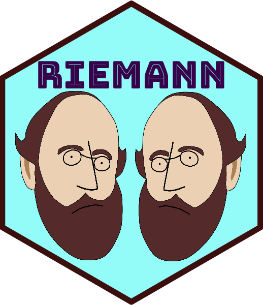

---
output:
  github_document:
    html_preview: false
---

<!-- README.md is generated from README.Rmd. Please edit that file -->

```{r, include = FALSE}
knitr::opts_chunk$set(
  collapse = TRUE,
  comment = "#>",
  fig.path = "man/figures/README-",
  out.width = "100%"
)
```

# Riemann 

<!-- badges: start -->
[](https://CRAN.R-project.org/package=Riemann)
[](https://app.codecov.io/gh/kisungyou/Riemann?branch=master)
[](https://CRAN.R-project.org/package=Riemann)
<!-- badges: end -->

**Riemann** brings established learning algorithms for manifold-valued data
together through a common R interface. It provides clustering, tangent PCA,
scalar-response kernel regression, descriptive summaries, inference, and
probability models for observations such as positive-definite matrices,
directions, and landmark shapes. The implementation combines R, native C++, and
selected R-package backends.

### Version 0.2.0

This documentation describes development version **0.2.0**, available from
GitHub and requiring **R 4.4 or later**. Its core workflow records the selected
geometry in fitted means, medians, tangent PCA, clustering, and scalar-response
kernel regression. Prediction reuses the training geometry and reference.
See the [release notes](https://www.kisungyou.com/Riemann/news/index.html)
for the changes and numerical corrections in this version.

```{r, message=FALSE}
library(Riemann)
x <- wrap.spd(list(diag(c(1, 2)), diag(c(2, 3)), diag(c(4, 1))))
fit <- riem.pga(x, ndim = 2, geometry = "log_euclidean")
predict(fit, x)
summary(fit)$geometry
```

Read the [geometry workflows](https://www.kisungyou.com/Riemann/articles/geometry-workflows.html),
[migration guide](https://www.kisungyou.com/Riemann/articles/migration.html), and
[descriptive data applications](https://www.kisungyou.com/Riemann/articles/data-workflows.html).
`riem.capabilities()` reports available geometric operations; the
[method contracts](https://www.kisungyou.com/Riemann/reference/riem-method-contracts.html) distinguish the
consolidated core from bounded legacy contracts and experimental routines.
Intrinsic Stiefel and correlation computations are currently unavailable.
Landmark shape workflows permit reflections through the full orthogonal group.

### License

The author-owned software in the September 21, 2026 revision of version 0.2.0
is licensed under [GPL-3](https://www.gnu.org/licenses/gpl-3.0.html). Earlier MIT releases and preserved
archives retain their original license. Third-party notices are retained in
`inst/COPYRIGHTS`; dependencies and the separate manuscript/replication
workspace retain their own license notices.

### Installation

* Option 1 : **released** version from [CRAN](https://CRAN.R-project.org).

``` r
install.packages("Riemann")
```

* Option 2 : **development** version from [GitHub](https://github.com/kisungyou/Riemann).

``` r
if (!require("devtools")) {
  install.packages("devtools")
}
devtools::install_github("kisungyou/Riemann")
```

### Contact

Report bugs through [GitHub issues](https://github.com/kisungyou/Riemann/issues)
or contact [Kisung You](mailto:kisung.you@outlook.com).
