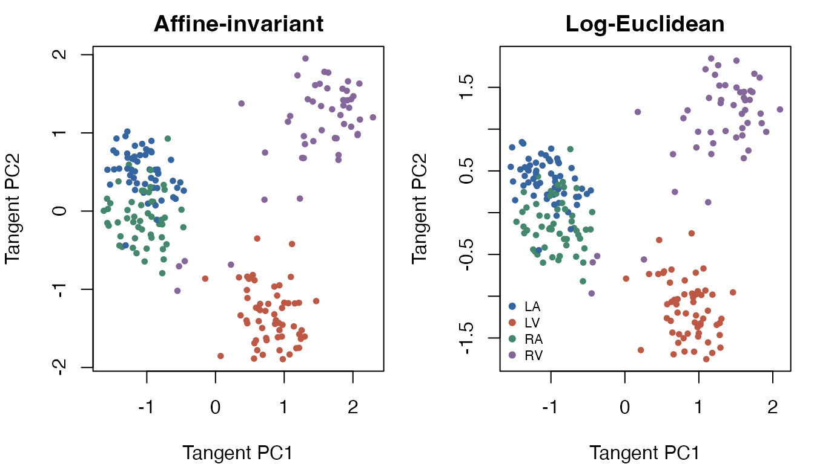
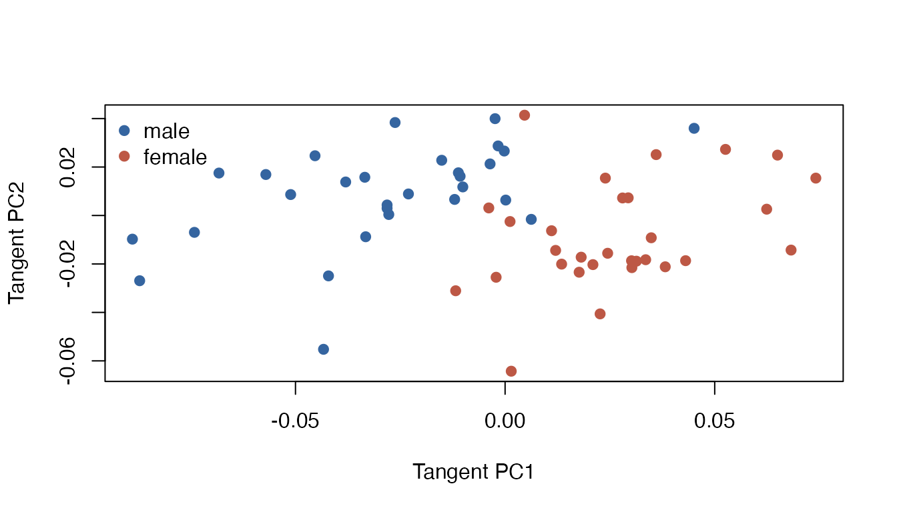
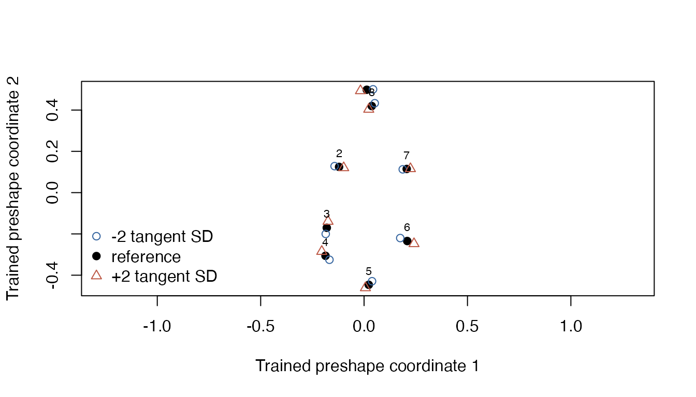

# Descriptive covariance and landmark applications

The package contains covariance matrices and landmark configurations
that can illustrate complete fitted workflows. These examples are
descriptive. Source provenance and the meaning of observations limit the
scientific claims they can support. The separate `write-JSS-Riemann/`
writing workspace contains `replication/code.R`, which separately
regenerates full data validation, model objects, figures, tables, and an
output manifest.

## Event-related covariance matrices

A reconstruction of the [historical pyRiemann 0.2.7
recipe](https://github.com/pyRiemann/pyRiemann/blob/176e766f540bd4c7846f38573165fc3d27fc69ca/examples/ERP/plot_embedding_EEG.py)
matched all 216 `ERP` matrices, with maximum relative Frobenius error
`5.56e-12` and exact label order, without rescaling, reordering, or sign
changes. These are test epochs from the single participant in the MNE
sample audiovisual experiment. The recipe selects 305 MEG sensors and
fits supervised xDAWN filters on 72 separate training epochs. Its 32
covariance coordinates combine 16 class-prototype and 16 filtered trial
features; they are not original sensor channels. See
[`?ERP`](https://www.kisungyou.com/Riemann/reference/ERP.md) for
filtering, epoch, split, and covariance settings. The [public MNE sample
record](https://doi.org/10.18112/openneuro.ds000248.v1.2.4) declares
CC0. The reconstruction used recorded contemporary dependencies, so the
numerical match is not a claim of byte identity or recovery of the
original runtime. These descriptive examples do not treat 216 epochs as
independent participants, and a later split of the stored matrices does
not recreate the label-dependent feature-learning step or establish
new-participant performance.

``` r

data(ERP)
dim(ERP$covariance)
#> [1]  32  32 216
table(ERP$label)
#> 
#> LA LV RA RV 
#> 57 57 53 49
x <- wrap.spd(ERP$covariance)
spectral <- t(vapply(x$data, function(a) {
  values <- eigen(a, symmetric = TRUE, only.values = TRUE)$values
  c(minimum = min(values), maximum = max(values), ratio = min(values) / max(values))
}, numeric(3)))
stopifnot(all(spectral[, "minimum"] > 0))
apply(spectral, 2, range)
#>           minimum      maximum        ratio
#> [1,] 3.173722e-29 1.708662e-26 8.848081e-05
#> [2,] 7.213355e-29 5.609244e-25 3.828991e-03
```

No ridge, scaling, or guessed physical-unit conversion is applied. Very
small absolute eigenvalues do not themselves imply poor conditioning;
the dimensionless minimum/maximum ratio is recorded separately.

Fit two geometries to the same observations and retain their complete
references. The mean diagnostics report numerical convergence.

``` r

airm <- riem.pga(x, ndim = 2, geometry = "affine_invariant", maxiter = 300, eps = 1e-7)
loge <- riem.pga(x, ndim = 2, geometry = "log_euclidean", maxiter = 300, eps = 1e-7)
stopifnot(airm$diagnostics$converged, loge$diagnostics$converged)
data.frame(
  geometry = c("affine_invariant", "log_euclidean"),
  mean_objective = c(airm$diagnostics$mean$objective, loge$diagnostics$mean$objective),
  tangent_variance_retained = c(sum(airm$explained.variance), sum(loge$explained.variance))
)
#>           geometry mean_objective tangent_variance_retained
#> 1 affine_invariant       25.61557                0.09125560
#> 2    log_euclidean       22.40366                0.08942419
```

The two-dimensional displays retain only 9.1% and 8.9% of their
respective tangent variances. They are partial views of a
higher-dimensional sample; their appearance cannot establish
classification performance or a neurophysiological difference.
Objectives under different geometries are different estimands, so their
numerical magnitudes alone do not rank the geometries.

``` r

colors <- c("#3565a0", "#bd5845", "#43886c", "#84669b")
old <- par(mfrow = c(1, 2), mar = c(4, 4, 2, 1))
plot(airm$embed, col = colors[as.integer(ERP$label)], pch = 19, cex = 0.6,
     main = "Affine-invariant", xlab = "Tangent PC1", ylab = "Tangent PC2")
plot(loge$embed, col = colors[as.integer(ERP$label)], pch = 19, cex = 0.6,
     main = "Log-Euclidean", xlab = "Tangent PC1", ylab = "Tangent PC2")
legend("bottomleft", levels(ERP$label), col = colors, pch = 19, bty = "n", cex = 0.7)
```



``` r

par(old)
```

The same saved object can transform observations one at a time. This is
a software reuse check, not an independent test set.

``` r

one_matrix <- wrap.spd(list(ERP$covariance[, , 1]))
stopifnot(max(abs(predict(loge, one_matrix) - loge$embed[1, , drop = FALSE])) < 1e-8)
reconstructed <- riem.reconstruct(loge, predict(loge, one_matrix))
stopifnot(min(eigen(reconstructed$data[[1]], symmetric = TRUE)$values) > 0)
```

For a modest downstream task, fit descriptive clusters in the declared
metric. The label/cluster table is a cross-tabulation on the same
observations, not held-out prediction accuracy. No population-level
uncertainty estimate is justified here.

``` r

set.seed(91401)
clusters <- riem.kmeans(x, k = 4, geometry = "log_euclidean", nstart = 2,
                        maxiter = 100, mean.eps = 1e-8)
stopifnot(clusters$converged, identical(predict(clusters, x), clusters$cluster))
clusters$starts
#>   start valid converged       termination objective iterations empty_clusters
#> 1     1  TRUE      TRUE stable_assignment  4407.767          5              0
#> 2     2  TRUE      TRUE stable_assignment  4423.755          4              0
#>   error
#> 1      
#> 2
table(event_label = ERP$label, descriptive_cluster = clusters$cluster)
#>            descriptive_cluster
#> event_label  1  2  3  4
#>          LA 12  0 45  0
#>          LV  0 56  1  0
#>          RA  2  0 51  0
#>          RV  0  3  3 43
```

## Gorilla skull shape

The arrays contain 29 male and 30 female configurations with eight
corresponding landmarks in two dimensions. Their exact upstream mapping
was checked against `shapes` 1.2.8: reorder `gorm.dat` and `gorf.dat` by
`c(1, 5, 4, 3, 2, 8, 7, 6)` on the landmark dimension, retaining
coordinate and individual order. The [shapes
manual](https://cran.r-project.org/web/packages/shapes/refman/shapes.html)
attributes these data to Paul O’Higgins and cites O’Higgins and Dryden
(1993), *Journal of Human Evolution* 24, 183–205. The separate writing
workspace includes the executable
`maintenance/verify-gorilla-provenance.R` array-correspondence
verification script.

The workflow analyzes shape after removing location and scale. Its
quotient uses all orthogonal transformations, including reflections.
This choice is explicit: orientation-preserving shape or original skull
size would ask a different question.

``` r

data(gorilla)
as_list <- function(a) lapply(seq_len(dim(a)[3]), function(i) a[, , i])
raw <- c(as_list(gorilla$male), as_list(gorilla$female))
group <- factor(c(rep("male", 29), rep("female", 30)), levels = c("male", "female"))
shapes <- wrap.landmark(raw)
shape_fit <- riem.pga(shapes, ndim = 2, geometry = "shape_orthogonal",
                      maxiter = 300, eps = 1e-8)
stopifnot(shape_fit$diagnostics$converged)
summary(shape_fit)
#> Variance explained in the fitted tangent representation 
#>                    PC1          PC2
#> variance   0.001433009 0.0005266715
#> proportion 0.460481632 0.1692401304
#> cumulative 0.460481632 0.6297217626
```

The retained tangent variance is 63.0%. Sex labels describe this sample;
the example does not perform a population test or estimate a causal or
biological effect.

``` r

plot(shape_fit$embed, col = c("#3565a0", "#bd5845")[as.integer(group)], pch = 19,
     xlab = "Tangent PC1", ylab = "Tangent PC2")
legend("topleft", levels(group), col = c("#3565a0", "#bd5845"), pch = 19, bty = "n")
```



Verify that the model uses its trained frame when new batches are
wrapped. This check covers positive scaling, translation, rotation,
reflection, and single-observation prediction.

``` r

angle <- 0.6
rotation <- matrix(c(cos(angle), sin(angle), -sin(angle), cos(angle)), 2)
transformed <- lapply(raw, function(a) sweep(2.3 * a %*% rotation, 2, c(30, -5), "+"))
reflected <- lapply(raw, function(a) a %*% diag(c(-1, 1)))
checks <- c(
  location_scale_rotation = max(abs(predict(shape_fit, wrap.landmark(transformed)) - shape_fit$embed)),
  reflection = max(abs(predict(shape_fit, wrap.landmark(reflected)) - shape_fit$embed)),
  singleton = max(abs(do.call(rbind, lapply(raw, function(a) {
    predict(shape_fit, wrap.landmark(list(a)))
  })) - shape_fit$embed))
)
stopifnot(all(checks < 1e-7))
checks
#> location_scale_rotation              reflection               singleton 
#>            2.380908e-16            0.000000e+00            1.804112e-16
```

Reconstruct a small variation along the first component. Landmark
numbers indicate stored correspondences; no anatomical names or outlines
are inferred.

``` r

scores <- matrix(0, 3, 2)
scores[, 1] <- c(-2, 0, 2) * sqrt(shape_fit$variance[1])
mode <- riem.reconstruct(shape_fit, scores)$data
plot(mode[[2]], asp = 1, pch = 19,
     xlim = range(vapply(mode, function(a) a[, 1], numeric(8))),
     ylim = range(vapply(mode, function(a) a[, 2], numeric(8))),
     xlab = "Trained preshape coordinate 1",
     ylab = "Trained preshape coordinate 2")
points(mode[[1]], col = "#3565a0", pch = 1)
points(mode[[3]], col = "#bd5845", pch = 2)
text(mode[[2]], labels = seq_len(8), pos = 3, cex = 0.7)
legend("bottomleft", c("-2 tangent SD", "reference", "+2 tangent SD"),
       col = c("#3565a0", "black", "#bd5845"), pch = c(1, 19, 2), bty = "n")
```



These reconstructions remain in the supported regular local shape
neighborhood. Singular alignments and reconstructions outside that chart
are explicit errors, not additional validated cases. Full numerical
records and both component-mode plots are generated by the separate
replication entry point.

``` r

sessionInfo()
#> R version 4.5.2 (2025-10-31)
#> Platform: aarch64-apple-darwin20
#> Running under: macOS Tahoe 26.6.2
#> 
#> Matrix products: default
#> BLAS:   /System/Library/Frameworks/Accelerate.framework/Versions/A/Frameworks/vecLib.framework/Versions/A/libBLAS.dylib 
#> LAPACK: /Library/Frameworks/R.framework/Versions/4.5-arm64/Resources/lib/libRlapack.dylib;  LAPACK version 3.12.1
#> 
#> locale:
#> [1] C.UTF-8/C.UTF-8/C.UTF-8/C/C.UTF-8/C.UTF-8
#> 
#> time zone: America/New_York
#> tzcode source: internal
#> 
#> attached base packages:
#> [1] stats     graphics  grDevices utils     datasets  methods   base     
#> 
#> other attached packages:
#> [1] Riemann_0.2.0
#> 
#> loaded via a namespace (and not attached):
#>  [1] tidyselect_1.2.1     hdrcde_3.5.0         dplyr_1.2.1         
#>  [4] farver_2.1.2         bitops_1.1-0         S7_0.2.2            
#>  [7] RCurl_1.98-1.20      fastmap_1.2.0        pracma_2.4.6        
#> [10] maotai_0.3.0         RANN_2.6.3           digest_0.6.39       
#> [13] lifecycle_1.0.5      cluster_2.1.8.3      rstiefel_1.0.1      
#> [16] magrittr_2.0.5       dbscan_1.2.6         compiler_4.5.2      
#> [19] rlang_1.3.0          sass_0.4.10          tools_4.5.2         
#> [22] mclustcomp_0.3.5     yaml_2.3.12          knitr_1.51          
#> [25] htmlwidgets_1.6.4    scatterplot3d_0.3-45 mclust_6.1.3        
#> [28] RColorBrewer_1.1-3   rainbow_3.8          KernSmooth_2.23-27  
#> [31] fda_6.3.0            Rtsne_0.17           desc_1.4.3          
#> [34] pcaPP_2.0-5          grid_4.5.2           clarabel_0.11.3     
#> [37] colorspace_2.1-3     ADMM_0.3.4           T4cluster_0.1.4     
#> [40] fastcluster_1.3.0    ggplot2_4.0.3        scales_1.4.0        
#> [43] iterators_1.0.14     MASS_7.3-66          mvtnorm_1.4-2       
#> [46] cli_3.6.6            rmarkdown_2.31       ragg_1.5.2          
#> [49] generics_0.1.4       otel_0.2.0           RSpectra_0.16-2     
#> [52] RcppDE_0.1.9         CVXR_1.9.2           scs_3.2.7           
#> [55] fds_1.9              cachem_1.1.0         splines_4.5.2       
#> [58] parallel_4.5.2       vctrs_0.7.3          T4transport_0.1.9   
#> [61] Matrix_1.7-6         jsonlite_2.0.0       systemfonts_1.3.2   
#> [64] foreach_1.5.2        gsignal_0.3-7        jquerylib_0.1.4     
#> [67] glue_1.8.1           pkgdown_2.2.1        codetools_0.2-20    
#> [70] DEoptim_2.2-8        gtable_0.3.6         osqp_1.0.0          
#> [73] gmp_0.7-5.1          tibble_3.3.1         pillar_1.11.1       
#> [76] htmltools_0.5.9      deSolve_1.42         R6_2.6.1            
#> [79] textshaping_1.0.5    Rdpack_2.6.6         ks_1.15.3           
#> [82] doParallel_1.0.17    lpSolve_5.6.23       evaluate_1.0.5      
#> [85] lattice_0.23-1       rbibutils_2.4.1      backports_1.5.1     
#> [88] highs_1.14.0-2       bslib_0.12.0         Rcpp_1.1.2          
#> [91] checkmate_2.3.4      xfun_0.60            fs_2.1.0            
#> [94] Rdimtools_1.1.5      pkgconfig_2.0.3
```
